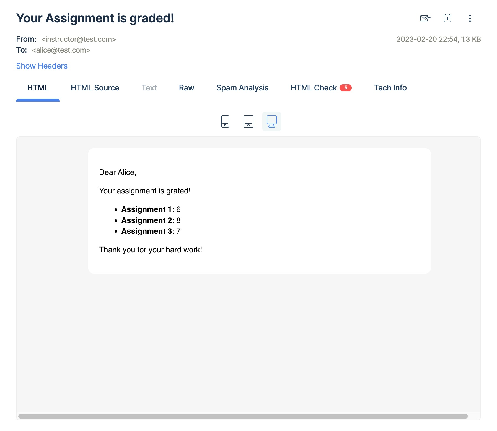

# BCIT Technical Test: Marking

- Frontend: React
- Backend: Node.js + MySQL


## Run

```
docker-compose up
```

Go http://localhost:3000/

## Basic Requirment

Commit:

```
617e6 frontend[update]: index.html
```

## Bonus: Login feature

Commit:

```
cfe13 frontend[update]: opt
```

Instructor Account Info: `instructor@test.com` / `password`

Default students:
- `alice@test.com` / `password`
- `bruce@test.com` / `password`
- `chris@test.com` / `password`

## Bonus: Email feature

Latest commit

I use Mailtrap's testing fake server, so will need to update the Mailtrap account(`MAILTRAP_CONFIG/auth`) in `backend/config.js` to receive the email.

Here's the email


## Reference
 - [Docker compose : NodeJS and MySQL app with React in a docker](http://www.bogotobogo.com/DevOps/Docker/Docker-React-Node-MySQL-App.php)